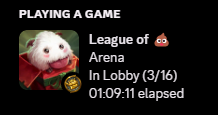
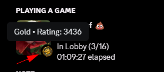
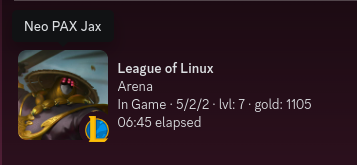

<!--  -->


<div align="left">

<a href="https://github.com/its-haze/league-rpc/releases/latest"></a> <a href="https://github.com/its-haze/league-rpc/stargazers"></a> <a href="https://github.com/its-haze/league-rpc/issues"></a> <a href="https://github.com/its-haze/league-rpc/blob/master/LICENSE"></a>

</div>

  

# A Better League of Legends Rich Presence For Discord!

**Enhance your Discord experience while playing League of Legends!** This project brings unique Discord Rich Presence integration for League players, including features not even available natively from the game!


Got questions already? Don't hesitate to join the [Discord Community Server](https://discord.haze.sh)

## Table of Contents
- [Showcase](#showcase)
- [Installation](#installation)
- [Command Line Arguments](#command-line-arguments)
- [Features](#features)
- [Tips for Running](#tips-for-running)
- [FAQ](#faq)
- [Contact and Support](#contact-and-support)
- [History](#history)


## Showcase

### Summoner Icons

Who let the Kitten and the Penguin out? I did 😎. Now you too, can show off your favorite summoner icon, righ there on Discord!

 

### Ranked Games

You can show off your rank emblem right in your Discord Presence.
- SoloQ/Flex:  Shows off your Rank emblem + LP
- TFT: Shows off your TFT rank emblem + LP
- Arena: Shows off your Arena meddalion + Your rating

If you really don't want to show your rank, then add the ``--no-rank`` argument, to **disable** this feature. As it's enabled by default.

 

### In Game

#### Skins (Animated ones are included)


### TFT (Teamfight tactics)
Showcase your favorite TFT Companion!
 

### Arena
To show these Arena ranked emblems, you will need to add the argument ``--show-rank`` when starting this application

 


### Swarm
Swarm PVE is now officially supported


---

## Installation

### Prerequisites
- You will need to have [Windows Terminal](https://aka.ms/terminal) installed, and set as your [Default Terminal](https://devblogs.microsoft.com/commandline/windows-terminal-as-your-default-command-line-experience/)


### Download the latest version.
1.  Go to the [Releases Page](https://github.com/Its-Haze/league-rpc/releases)
2.  Find the latest version and download `leagueRPC.exe` located under the assets section.

### Run the application.
1. Locate the downloaded `leagueRPC.exe` file. Probably in your `Downloads` folder.
2. Double-click the file to start leagueRPC.
  You will need to accept the windows popup, if one may appear.
3. Done ✨

---

## Build from source (This is what the cool kids do!)
If you prefer using the command line, follow these steps:

- Use the following command to clone the repository to your local machine:
   ```powershell
   git clone https://github.com/Its-Haze/league-rpc.git
   cd league-rpc
   ```
- A virtual environment helps to keep dependencies required by different projects separate, creating isolated python environments for them. This is highly recommended to avoid conflicts between project dependencies.
   ```powershell
   python -m venv venv
   .\venv\Scripts\activate
   ```
- With the virtual environment activated, install the required dependencies using:
   ```
   pip install -r requirements.txt
   ```
- You will need pyinstaller for this to work
  ```powershell
  pip install pyinstaller
  ```
- Build
  ```powershell
  # Assuming your current directory is "league-rpc"
  pyinstaller --onefile --name leagueRPC.exe league_rpc/__main__.py --clean --distpath .
  ```
- Run
  ```powershell
  .\leagueRPC.exe
  ```

---

## Command Line Arguments

LeagueRPC supports various command-line arguments to enhance flexibility and user customization.

✨ Means Recommended.

### `--launch-league <location>` ✨

The `--launch-league` argument allows you to automatically launch the League of Legends client alongside leagueRPC. This feature is designed to make your experience more seamless by integrating the game launch into the RPC setup.

By default, if `--launch-league` is specified without a path, the default installation path will be used:
```plaintext
C:\Riot Games\Riot Client\RiotClientServices.exe
```
This path is correct for the majority of installations. If your League of Legends client is installed in this location, you do not need to specify the path explicitly.

If you have installed League of Legends in a non-default location, you must provide the path to the RiotClientServices.exe file when using --launch-league. For example, if your game is installed on the D drive, you can start leagueRPC with the game like this:

```powershell
.\leagueRPC.exe --launch-league "D:\Riot Games\Riot Client\RiotClientServices.exe"
```
This command tells leagueRPC to launch the League of Legends client from the specified location.


### `--client-id <discord-app-id>` ✨
Specify a custom Discord client ID for the RPC connection. Defaults to `League of Legends`
**Example** `.\leagueRPC.exe --client-id 1230607224296968303` - This will show `League of Kittens`
- **League of Kittens**: `1230607224296968303`
- **League of Linux**: `1185274747836174377`

You can create your own here: [Discord Developer Portal](https://discord.com/developers/applications). Then use the `APPLICATION ID`

### `--no-stats`
Opt out of displaying in-game KDA and minion (creep score) statistics in your Discord Rich Presence. By default, these stats are shown.

**Example**: `.\leagueRPC.exe --no-stats`


### `--no-rank`
Hide your League rank on Discord (SoloQ/Flex/TFT/Arena) By default, this will be enabled.

**Example**: `.\leagueRPC.exe --no-rank`


### `--hide-emojis`
Do you want to hide your Online/Away emoji?. Then add this argument. By default, this will be shown.

**Example**: `.\leagueRPC.exe --hide-emojis`

   

### `--add-process <process-name>`
Add custom Discord process names to the search list. This is useful if your Discord client is running under a different process name.

**Example**: `.\leagueRPC.exe --add-process CustomDiscord AnotherProcess`

### `--wait-for-league <seconds>` 
Specify the time (in seconds) the script should wait for the League of Legends client to start. Use `-1` for infinite waiting. This is particularly useful for auto-launch scenarios like with Lutris or other launchers, ensuring the script does not error out if League is not immediately detected. **Default is `-1`**

**Example**: `.\leagueRPC.exe --wait-for-league 30`

### `--wait-for-discord <seconds>`
Similar to `--wait-for-league`, specify the time (in seconds) to wait for Discord to start. Use `-1` for infinite waiting. This ensures that the script waits for Discord to fully start, avoiding premature errors. **Default is `-1`**

**Example**: `.\leagueRPC.exe --wait-for-discord 15`


### Combine arguments
Each of these arguments can be combined to tailor the Discord RPC to your preferences.

```powershell
.\leagueRPC.exe --client-id 1194034071588851783 --launch-league --no-stats --no-rank --add-process CustomDiscord --wait-for-league -1 --wait-for-discord 15 --show-emojis
```

🛑 All of these arguments are optional. No extra argument is needed for the script to function properly. But in case you want to change something, you now can.

## Features

1. **Dynamic Champion Skin Display**: If a skin is active, it will display the artwork of that skin, and it's name on Discord!
2. **Live KDA Stats**: Keep track of your Kills, Deaths, and Assists updated live during the game.
3. **Creep Score**: Your minions (creep score) are displayed, providing a comprehensive view of your in-game performance.
4. **Ranks**: Show your rank detailes on SoloQ/Flex, TFT, and Arena!
5. **Precise In-Game Time Tracking**: The in-game time is calculated with precision. Even if the script stops, when restarted, it will display the correct in-game time, ensuring continuous and accurate representation of your game status.
6. **Discord Reconnection Window**: While the script only works while Discord is up and running. There are instances where discord could crash. This program will attempt to reconnect to Discord's RPC even if the app is not running. For a period of time, and only exit when too much time has passed. Default is (50) seconds to restart/reconnect Discord.
7. **Disables Native League Presence**: This application is able to detect, and disable the built in rich presence coming from league, leaving only this one active as your main Presence on discord. This was a huge issue before since it's not easy to disable. And now all you have to do is just start this application before launching the league client, and you will be good to go.
8. **Launches League of legends for you**: To avoid forgetting to start this application before league all the time, you can let the application start league for you. Please read about the `--launch-league` argument to learn more.

## Tips for Running

- **Windows Security Warning:** Depending on your Windows settings, you might see a warning about running downloaded software. If you trust the source, you can allow the app to run.
- **Adding to PATH:** If you prefer to run `leagueRPC.exe` from any location in the command prompt without navigating to the specific folder, you can add its folder to your system's PATH environment variable. Instructions for modifying the PATH are outside of the scope of this readme, but i can link a good guide on [How to add a folder to Path environment variable in Windows](https://stackoverflow.com/a/44272417).
- **Add Arguments while not running in the Terminal**: If you prefer double clicking, instead of running it from a terminal, then you can still add arguments to the execution.
  - Right click on leagueRPC.exe -> Select `Create shortcut`
  - Right click on the Shortcut -> Select `Properties`
  - In the `Target` field, you can add all your arguments after `leagueRPC.exe`
  - Then just double click the shortcut to launch the program.


## FAQ

**Q: Will this get my account banned?**
  - No, it uses Riot's local API at `127.0.0.1:2999`, so it will not cause any bans. And Vanguard will not ban you for using it.

**Q: League's native RPC is still running. how do i turn it off?**
  - To Disable the native league presence, it requires that this program is ran **before** the League Client starts up.
    - You can start this application whenever you like. But the native league presence can only be disabled during the launch of the League Client.

**Q: Does Riot approve this?**
  - This is an independent project, not affiliated with Riot Games. This project is Open Source (as you can tell), mainly to protect your Privacy and Security. Running executables from strangers on the internet is never safe, so this is why the source code is open for you to read.

**Q: Does it support TFT?**
  - Yes! TFT is supported. leagueRPC will also display your current level in game. I tried adding the gold amount, but riot does not have that feature ready yet.

**Q: Does it support Arena?**
  - Yes! Arena is supported. A cool emblem will be shown on your Discord Presence. Stats (K/D/A), the level, and gold amount will also be displayed!
  <!-- TODO Add Arena image -->

**Q: Does it support ARAM?**
  - Yes, ofcourse!

**Q: Can it run on Windows?**
  - Yes, Even though league already has a built in Presence, it's not as customizable and feature rich as this one. It's also very outdated, and some champions just won't show you any images. Really disappointing RIOT, step up your game!

**Q: Why doesn't the minnions (cs) update live?**
  - Trust me it's annoying for me as well. This is thanks to Riot Games not updating their API for every minnion killed, but rather updates every (10th) minnion killed. So this is sadly out of my control.


## Contact and Support
Got questions? Join the [Discord Server](https://discord.haze.sh) 
Feel free to open up Help tickets, or contact me directly on Discord (@haze.dev).

For issues related to the code, or project as a whole, please open an [issue on GitHub](https://github.com/Its-Haze/league-rpc/issues).


## History

This project was previously called `league-rpc-linux`, but since RIOT introduced Vanguard, and broke League on linux. I wanted to rename this project to `league-rpc`, and continue maintaining it for Windows users.

