<div align="left">

<a href="https://github.com/its-haze/league-rpc/releases/latest"></a> <a href="https://github.com/its-haze/league-rpc/stargazers"></a> <a href="https://github.com/its-haze/league-rpc/issues"></a> <a href="https://github.com/Its-Haze/league-rpc/blob/master/LICENSE.txt"></a>

</div>
⭐ Don't forget to star this project! ⭐

# A Better League of Legends Rich Presence For Discord!

**Enhance your Discord experience while playing League of Legends!** This project brings unique Discord Rich Presence integration for League players, including features not even available natively from the game!


Got questions already? Don't hesitate to join the [Discord Community Server](https://discord.haze.sh)

## Table of Contents
- [Installation](#installation)
- [Showcase](#showcase)
- [Command Line Arguments](#command-line-arguments)
- [Tips for Running](#-tips-for-running)
- [FAQ](#faq)
- [Build from source](#️-build-from-source)
- [Contact and Support](#-contact-and-support)
- [History](#-history)

---

## Installation

### ✅ Prerequisites
- It's recommended to have [Windows Terminal](https://aka.ms/terminal) installed, and set as your [Default Terminal](https://devblogs.microsoft.com/commandline/windows-terminal-as-your-default-command-line-experience/). This will make the application look more user friendly, with colorful messages, which you won't get if you are using the standard `cmd` terminal

### 📥 Download the latest version. 
1.  Go to the [Releases Page](https://github.com/Its-Haze/league-rpc/releases)
2.  Find the latest version and download `leagueRPC.exe` located under the assets section.

### ▶️ Run the application.
1. Locate the downloaded `leagueRPC.exe` file. Probably in your `Downloads` folder.
2. Double-click the file to start leagueRPC.
  You will need to accept the windows popup, if one may appear.
3. Done ✨

### 🔄 How do i update LeagueRPC?
- **How**: You will have to manually install the latest version from the [Releases Page](https://github.com/Its-Haze/league-rpc/releases)
- **When**: Since automatic updates don't yet exist, You will be informed in the terminal when you start LeagueRPC if a newer version is released. Please make sure to always run the latest version for the best experience.

---

## Showcase

### Summoner Icons

Who let the Kitten and the Penguin out? I did 😎. Now you too, can show off your favorite summoner icon, righ there on Discord!

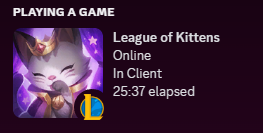 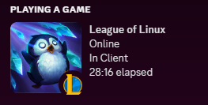

### Ranked Games

You can show off your rank emblem right in your Discord Presence.
- SoloQ/Flex:  Shows off your Rank emblem + LP
- TFT: Shows off your TFT rank emblem + LP
- Arena: Shows off your Arena meddalion + Your rating

If you want to hide your rank, then add the ``--no-rank`` argument, to **disable** this feature. As it's enabled by default.

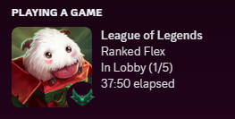 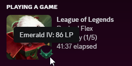

### In Game
- Show your selected skin.
  - **Animated skins**: Ultimate skins will be animated on Discord.
  - **Skin Names**: The name of the skin will be shown when hovering the skin on Discord. This includes **Chromas** as well.
- **KDA**: Display your Kills, Deaths, Assists and Creep Score (cs)
  - Can be disabled with `--no-stats`
- **Rank**: Show what rank you have depending on the gamemode you play in (SoloQ, Flex, TFT, Arena, etc.)
  - Can be disabled with `--no-rank`
- **Game timer**: The ingame timer is accurately represented on Discord. Which is something even League's own Rich Presence don't do.


#### Skins
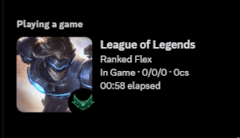 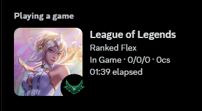  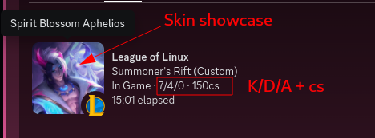

### TFT (Teamfight tactics)
Showcase your favorite TFT Companion!

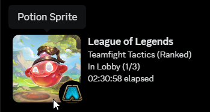 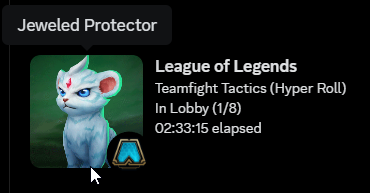

---

## Command Line Arguments

LeagueRPC supports various command-line arguments to enhance flexibility and user customization.

✨ Means that it's enabled by default, so you won't have to add it manually.

### `--launch-league <location>` ✨
Specify the location of your `RiotClientServices.exe` to automatically launch League of Legends

- **Default** Behavior: LeagueRPC searches for `RiotClientServices.exe` in common drives such as (C, D, E, F and more). If found, it launches League for you.
- **Why**: LeagueRPC disables League's native Discord presence during a brief window when the client starts. So it's best to allow LeagueRPC to start League for you.
- **When to Use**: If league is installed in a non-default location, provide the path manually.

```sh
# This will attemt to automatically launch league from the specified location.
leagueRPC.exe --launch-league "G:\Riot Games\Riot Client\RiotClientServices.exe"
```

---

### `--client-id <discord-app-id>` ✨
Change the displayed game on Discord by specifying a custom `--client-id`.

- **Default**: Displays "League of Legends"
- **Create your app**:
  - Create an app in the [Discord Developer Portal](https://discord.com/developers/applications).
  - Copy the `APPLICATION ID` and use it with `--client-id`.

```sh
# This will show that you are playing League of Kittens on Discord.
leagueRPC.exe --client-id 1230607224296968303
```
Other Options:
- **League of Kittens**: `1230607224296968303`
- **League of Linux**: `1185274747836174377`

---

### `--no-stats`
Hide in-game stats (KDA and creep score) from Discord Rich Presence.

- **Default**: Stats are shown.

```sh
# This will hide your KDA stats
leagueRPC.exe --no-stats
```

---

### `--no-rank`
Hide your League rank on Discord (SoloQ/Flex/TFT/Arena) By default, this will be enabled.

- **Default**: Rank and LP are displayed.

```sh
# This will hide your Rank and LP from Discord.
leagueRPC.exe --no-rank
```

---

### `--hide-emojis`
Do you want to hide your Online/Away emoji?. Then add this argument. By default, this will be shown.

- **Default**: Emojis are displayed (🟢 Online, 🔴 Away)

```sh
# This will hide the green emoji when you are online, and the red circle emoji when you are away.
leagueRPC.exe --hide-emojis
```

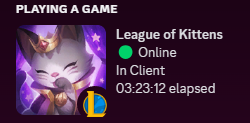 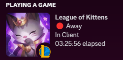

---

### `--add-process <process-name>`
Add custom process names for Discord to the search list. Useful if your Discord client uses a different process name.

```sh
# This adds more names of Discord alternatives, which will be used to try to connect to.
leagueRPC.exe --add-process CustomDiscord AnotherProcess
```
*Find process names via Task Manager.*

---

### `--wait-for-league <seconds>` ✨
Specify how long LeagueRPC should wait for League to launch before giving up.

- **Default**: `-1` (waits indefinitely).
- **Recommended**: Leave it as default

```sh
# This will wait 30 seconds for league to start. If it doesn't, it will terminate itself.
leagueRPC.exe --wait-for-league 30
```
*Use case: Legacy Linux setups (e.g., Lutris). No changes needed for Windows users.*

---

### `--wait-for-discord <seconds>` ✨
Set how long LeagueRPC should wait for Discord to start before continuing.

- **Default**: `-1` (waits indefinitely).
- **Recommended**: Leave it as default.

```sh
# This will wait 30 seconds for Discord to start and connect. If it doesn't, it will terminate itself.
leagueRPC.exe --wait-for-discord 30
```

---

### Combine arguments
Each of these arguments can be combined to tailor the Discord RPC to your preferences.

```sh
leagueRPC.exe --client-id 1194034071588851783 --launch-league --no-stats --no-rank --add-process CustomDiscord --wait-for-league -1 --wait-for-discord 30 --hide-emojis
```

🛑 All arguments are optional. No extra argument is needed for the script to function properly. But in case you want to change something, you can.

---

## 💡 Tips for Running

### 🛡️ Virus/Malware detected by Windows Defender!
You will need to **whitelist** LeagueRPC in your antivirus program if it complains that it's malware (it's not).
Windows Defender, and other antivirus software usually flag software that is not **Code Signed**. Code signing costs $100 per year, and it's not something I will spend my money on since this is a free program.

For those that are paranoid. Build the program from the source code, it's there and public for anyone to look at.

### 🖱️ How to add arguments, without using a terminal

If you prefer double clicking, instead of running it from a terminal, then you can still add arguments to the execution.
  - Right click on leagueRPC.exe -> Select `Create shortcut`
  - Right click on the Shortcut -> Select `Properties`
  - In the `Target` field, you can add all your arguments after `leagueRPC.exe`
  - Then just double click the shortcut to launch the program.

---

## ❓FAQ

### 🚫 Will this get my account banned?
- No, it uses Riot's local API at `127.0.0.1:2999`, so it will not cause any bans. And Vanguard will not ban you for using it.


### 🛡️ Is this a virus/malware?
- No, it’s not. This application connects to the League of Legends API to fetch data, only nessesary to fulfill this applications main goal. (To serve a better Discord Rich Presence). It then sends that data to Discord to update the Rich Presence. While this behavior is entirely legitimate and necessary for the application to function, it might resemble the behavior of unwanted software to some antivirus programs.
- Because of this, certain antivirus apps like Windows Defender may incorrectly flag this app as a virus or malware. This is a false positive. The application is completely open source, and its code is available here on GitHub for you to review or build yourself, so you can verify exactly what it does.
- If you trust this application, you may need to whitelist it in your antivirus software to prevent it from being flagged or removed. This is simply a precaution due to how antivirus software identifies potential threats, not because the application is malicious in any way.


### 🛠️ League's native RPC is still running. how do i turn it off?
- In order for league's native rich presence to be disabled, you would have to make sure that LeagueRPC starts league for you. This is because there is a small window where the discord integration can be disabled. Its between the time the Riot client starts up, until you are logged in to the league client. In between this time, LeagueRPC will attemt to disable the native rpc so that this app can take that role on Discord.
- If you still experience issues that league's native rpc is running, then maybe your Client starts up too fast. 
- Do the following if the native rpc is still not disabled:
  - Log out of the league client
  - Close the league client completely
  - Start LeagueRPC.exe, and let it start league for you (after about a second or so, the native league presence should be disabled)
  - You can now log back into the league client.
  - If it still does not work, report a ticket on Github, or ask for direct help on the [Discord Community Server](https://discord.haze.sh)

### ✔️ Does Riot approve this?
- This is an independent project, not affiliated with Riot Games. This project is Open Source (as you can tell), mainly to protect your Privacy and Security. Running executables from strangers on the internet is never safe, so this is why the source code is open for you to read.


### 🎮 Does it support other gamemodes, like TFT & Arena?
- Yes! TFT, ARAM, Arena, Swarms and other gamemodes that come out as well.

### 📉 Why doesn't the minnions (cs) update live?
- Trust me it's annoying for me as well. This is thanks to Riot Games not updating their API for every minnion killed, but rather updates every (10th) minnion killed. So this is sadly out of my control.

---

## 🏗️ Build from source
This is what the cool kids do!

If you prefer using the command line, follow these steps:

- Use the following command to clone the repository to your local machine:
   ```powershell
   git clone https://github.com/Its-Haze/league-rpc.git
   cd league-rpc
   ```
- A virtual environment helps to keep dependencies required by different projects separate, creating isolated python environments for them. This is highly recommended to avoid conflicts between project dependencies.
   ```powershell
   python -m venv venv
   .\venv\Scripts\activate
   ```
- With the virtual environment activated, install the required dependencies using:
   ```
   pip install -r requirements.txt
   ```
- You will need pyinstaller for this to work
  ```powershell
  pip install pyinstaller
  ```
- Build
  ```powershell
  # Assuming your current directory is "league-rpc"
  pyinstaller --onefile --name leagueRPC.exe league_rpc/__main__.py --clean --distpath .
  ```
- Run
  ```powershell
  .\leagueRPC.exe
  ```

---

## 📞 Contact and Support
Got questions? Join the [Discord Server](https://discord.haze.sh) 
Feel free to open up Help tickets, or contact me directly on Discord (@haze.dev).

For issues related to the code, or project as a whole, please open an [issue on GitHub](https://github.com/Its-Haze/league-rpc/issues).

---

## 📜 History

This project was previously called `league-rpc-linux`, but since RIOT introduced Vanguard, and broke League on linux. I wanted to rename this project to `league-rpc`, and continue maintaining it for Windows users.

## Star History

<a href="https://star-history.com/#its-haze/league-rpc&Date">
 <picture>
   <source media="(prefers-color-scheme: dark)" srcset="https://api.star-history.com/svg?repos=its-haze/league-rpc&type=Date&theme=dark" />
   <source media="(prefers-color-scheme: light)" srcset="https://api.star-history.com/svg?repos=its-haze/league-rpc&type=Date" />
   
 </picture>
</a>

