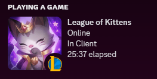
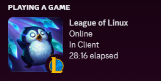
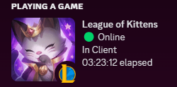
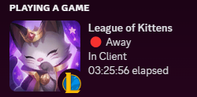
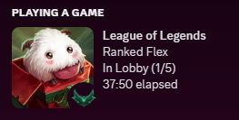
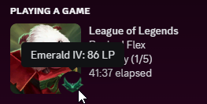
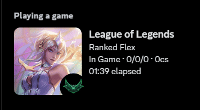
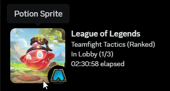
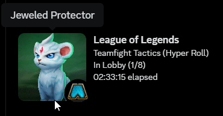
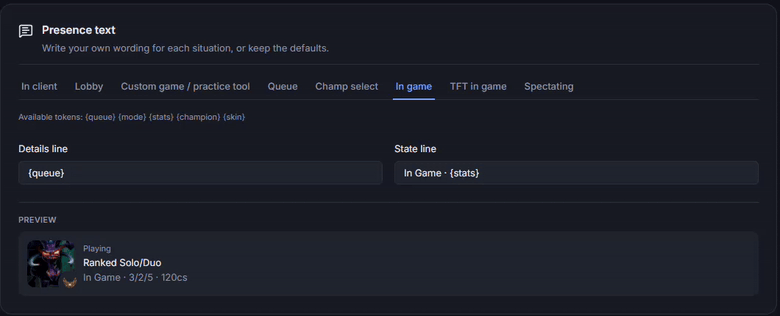

<!--
  Two Table of Contents links start with an invisible U+FE0F. The emoji in the
  "Settings" and "Build from Source" headings carry a variation selector that
  GitHub keeps when it generates the anchor. Removing it breaks those links.
-->

<div align="center">


<p>A better League of Legends Rich Presence for Discord.</p>

<p>
<a href="https://github.com/its-haze/league-rpc/releases/latest"></a>
<a href="https://github.com/its-haze/league-rpc/stargazers"></a>
<a href="https://github.com/its-haze/league-rpc/releases/latest"></a>
<a href="https://github.com/its-haze/league-rpc/blob/master/LICENSE"></a>
</p>

<h3><a href="https://github.com/its-haze/league-rpc/releases/latest"><strong>Download for Windows &raquo;</strong></a></h3>

<p>
<a href="#about">About</a>
&middot;
<a href="#installation">Installation</a>
&middot;
<a href="#showcase">Showcase</a>
&middot;
<a href="#-faq">FAQ</a>
</p>

</div>

## About

League RPC is a Discord Rich Presence application for League of Legends. It reads your League
client and shows what you're doing on your Discord profile, in place of the generic status
Discord gives you. You control what appears and how each line is worded.

⭐ If you enjoy it, don't forget to star this project! ⭐

Got questions already? Don't hesitate to join the [Discord Community Server](https://discord.haze.sh)

> **NEW:** Get a better rich presence on Valorant with [Valorant RPC](https://github.com/Its-Haze/valorant-rpc).

## Table of Contents
- [Installation](#installation)
- [Showcase](#showcase)
- [Settings](#️-settings)
- [FAQ](#-faq)
- [Build from Source](#️-build-from-source)
- [Support the project](#-support-the-project)
- [Contact and Support](#-contact-and-support)
- [History](#-history)

---

## Installation

### 📥 Getting Started
1. Head over to the [Releases Page](https://github.com/its-haze/league-rpc/releases)
2. Download `league-rpc-<version>-setup.exe` from the latest release (it's under Assets)
3. Run it and accept the Windows security popup if it shows up
4. Start League and Discord, in whatever order you like
5. That's it! ✨

Closing the window keeps League RPC running in your system tray. Quit from there when you want it to stop.

### 🔄 Updating
You can update directly from the app. If you have **update notifications** enabled, you will see a notification that a new version is available.

Otherwise go to **About** → **Check for updates** and install from there.

---

## Showcase

### Summoner Icons

Who let the Kitten and the Penguin out? Your summoner icon shows up on Discord while you're still deciding what to play.

 

There's an online and away marker too, if you want it.

 

### Ranked Games

Your rank emblem, right there on your presence.
- **Solo/Duo and Flex**: your emblem and LP
- **TFT**: your TFT emblem and LP
- **Arena**: your medallion and rating

Whichever queue you're in is the one that gets shown, so a Flex game never advertises your Solo/Duo rank. If you'd rather keep it to yourself, turn **Show rank** off in the app.

 

### In Game

- **Your skin** as the artwork, with the name on hover. Chromas included.
- **KDA and CS**, so people can see how it's going.
- **Your rank**, so you can flex if you're high elo. Or hide it if you don't want people to know.
- **A game timer** that matches the match clock.

#### Skins



##### All Animated Skins

Ultimate skins animate on Discord.

<div align="left">
  
  
  
  
  
</div>

<div align="left">
  
  
  
  
  
</div>

<div align="left">
  
  
  
  
  
</div>

### TFT (Teamfight Tactics)

Showcase your favourite TFT Companion!

 

### Write Your Own

Every line Discord shows is a template. Rewrite it, drop in your queue, champion or score, and the preview updates as you type. Each situation has its own: client, lobby, custom game, queue, champ select, in game, TFT and spectating.



---

## ⚙️ Settings

Everything is set inside the app, and every change saves the moment you make it. There's no save button to remember and no file to edit by hand. Changed your mind about something? Every setting can go back to its default on its own, without touching the rest.

---

## ❓ FAQ

### 🚫 Will this get my account banned?
Nope! It only reads what Riot already publishes on your own computer. It changes nothing, injects nothing and gives you no advantage in game, so Vanguard has no reason to care.

### 🛡️ Is this a virus? Why is Windows warning me?
No, and because it isn't code-signed. A certificate costs $100 a year, which is hard to justify for a free project, so Windows distrusts an installer it hasn't seen before. Click **More info**, then **Run anyway**, and whitelist it if Defender gets loud. The entire source code is public on GitHub, so review it or build it yourself.

### ✔️ Does Riot approve this?
This is an independent open-source project. It isn't affiliated with Riot Games.

There's a longer FAQ inside the app, under **Help**, for the questions you only run into once it's running.

---

## 🏗️ Build from Source
For the cool kids who want to build it themselves:

```powershell
# Clone and navigate
git clone https://github.com/its-haze/league-rpc.git
cd league-rpc

# Build
task build
```

You'll need Go, Node and [Task](https://taskfile.dev/). [CONTRIBUTING.md](CONTRIBUTING.md) has the rest: exact versions, the Wails setup, how to build the installer, and how releases are signed.

---

## 💖 Support the project
League RPC is free, and it stays that way. No ads, no accounts, no feature locked behind a payment.
I build and maintain it in my spare time because I wanted it to exist.

If it's earned a spot in your startup folder and you'd like to chip in toward keeping it maintained,
there are two ways:

- [**GitHub Sponsors**](https://github.com/sponsors/Its-Haze) takes no cut, and does one-time or monthly.
- [**Ko-fi**](https://ko-fi.com/itshaze) needs no account, just a card or PayPal.

[](https://ko-fi.com/O0N227CV0N)

Neither unlocks a feature. Supporters get a role in the [Discord](https://discord.haze.sh), and a star costs nothing at all.

---

## 📞 Contact and Support
Got questions? Join the [Discord Server](https://discord.haze.sh)
Feel free to open up Help tickets, or contact me directly on Discord (@haze.dev).

For issues related to the code, or project as a whole, please open an [issue on GitHub](https://github.com/its-haze/league-rpc/issues). Before you do, hit **Copy diagnostics** on the app's Help screen and paste the result in. It gathers most of what I'd otherwise have to ask you for.

---

## 📜 History

- 2023 - This project was previously called `league-rpc-linux`. When Riot introduced Vanguard and broke league on linux, i renamed it to `league-rpc` and kept maintaining it for Windows users. This is why there is a `League of linux` option to select in the application.
- 2026 - Rewrote the application from a Terminal based Python app, to a Golang application with a GUI and tray app. Needed to rewrite the entire `lcu-driver` from scratch in golang to get it working. So i built [lcu-gopher](https://github.com/Its-Haze/lcu-gopher) which this project now uses.

## Star History

<a href="https://star-history.com/#its-haze/league-rpc&Date">
 <picture>
   <source media="(prefers-color-scheme: dark)" srcset="https://api.star-history.com/svg?repos=its-haze/league-rpc&type=Date&theme=dark" />
   <source media="(prefers-color-scheme: light)" srcset="https://api.star-history.com/svg?repos=its-haze/league-rpc&type=Date" />
   
 </picture>
</a>
