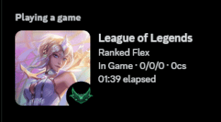

<div align="left">

<a href="https://github.com/its-haze/league-rpc/releases/latest"></a> 
<a href="https://github.com/its-haze/league-rpc/stargazers"></a> 
<a href="https://github.com/its-haze/league-rpc/issues"></a> 
<a href="https://github.com/Its-Haze/league-rpc/blob/master/LICENSE.txt"></a>

</div>

⭐ **Don't forget to star this project!** ⭐

---

# 🚀 A Better League of Legends Rich Presence for Discord!

**Enhance your Discord experience while playing League of Legends!**  
This project brings **unique** Discord Rich Presence integration for League players, including features not even available natively from the game!

👉 **Join the [Discord Community Server](https://discord.haze.sh)** if you have questions!

---

## 📚 Table of Contents

- [Installation](#installation)
- [Showcase](#showcase)
- [Command Line Arguments](#command-line-arguments)
- [Tips for Running](#tips-for-running)
- [FAQ](#faq)
- [Build from Source](#build-from-source)
- [Contact and Support](#contact-and-support)
- [History](#history)

---

## 🛠️ Installation

<details>
<summary><strong>✅ Prerequisites</strong></summary>

- **Windows Terminal** is recommended for a better experience:
  - Install: [Windows Terminal](https://aka.ms/terminal)
  - Set as default: [Windows Terminal as Default Terminal](https://devblogs.microsoft.com/commandline/windows-terminal-as-your-default-command-line-experience/)
</details>

<details>
<summary><strong>📥 Download the Latest Version</strong></summary>

1. Go to the [Releases Page](https://github.com/Its-Haze/league-rpc/releases).
2. Download the latest `leagueRPC.exe` under the assets section.
</details>

<details>
<summary><strong>▶️ Run the Application</strong></summary>

1. Locate `leagueRPC.exe` (usually in your `Downloads` folder).
2. Double-click it to start.
   - Accept the Windows popup if it appears.
3. Done! ✨
</details>

<details>
<summary><strong>🔄 Updating LeagueRPC</strong></summary>

- **How**: Download the latest version from the [Releases Page](https://github.com/Its-Haze/league-rpc/releases).
- **When**: The terminal will notify you if a newer version is available.
</details>

---

## 🎨 Showcase

### Summoner Icons
Show off your favorite summoner icon directly in Discord!

 

### Ranked Games
- SoloQ/Flex: Rank emblem + LP  
- TFT: TFT rank emblem + LP  
- Arena: Arena medallion + rating  
- Hide rank: Use `--no-rank`  

 

### In Game
- **Skins**: Animated skins for Ultimate skins + names
- **KDA**: Kills, Deaths, Assists, CS
- **Rank**: Game mode-specific rank
- **Timer**: Accurate in-game timer

  

### TFT Companions
Showcase your favorite TFT Companion!

 

---

## ⚙️ Command Line Arguments

✨ **Enabled by default.**

<details>
<summary><strong>--launch-league &lt;location&gt; ✨</strong></summary>

Specify the location of your `RiotClientServices.exe` to automatically launch League.

```sh
leagueRPC.exe --launch-league "G:\Riot Games\Riot Client\RiotClientServices.exe"
```

**Default**: LeagueRPC searches for it in common drives.  
**Why**: Disables League's native RPC for better integration.
</details>

<details>
<summary><strong>--client-id &lt;discord-app-id&gt; ✨</strong></summary>

Change the displayed game on Discord.

```sh
leagueRPC.exe --client-id 1230607224296968303
```

- League of Kittens: `1230607224296968303`
- League of Linux: `1185274747836174377`
</details>

<details>
<summary><strong>--no-stats</strong></summary>

Hide KDA and CS stats from Discord.

```sh
leagueRPC.exe --no-stats
```
</details>

<details>
<summary><strong>--no-rank</strong></summary>

Hide your League rank.

```sh
leagueRPC.exe --no-rank
```
</details>

<details>
<summary><strong>--hide-emojis</strong></summary>

Hide the green/red status emojis.

```sh
leagueRPC.exe --hide-emojis
```
</details>

<details>
<summary><strong>--hide-in-client</strong></summary>

Hide Rich Presence while idle in client.

```sh
leagueRPC.exe --hide-in-client
```
</details>

<details>
<summary><strong>--add-process &lt;process-name&gt;</strong></summary>

Add custom process names.

```sh
leagueRPC.exe --add-process CustomDiscord AnotherProcess
```
</details>

<details>
<summary><strong>--wait-for-league &lt;seconds&gt; ✨</strong></summary>

Specify how long to wait for League to start.

```sh
leagueRPC.exe --wait-for-league 30
```
</details>

<details>
<summary><strong>--wait-for-discord &lt;seconds&gt; ✨</strong></summary>

Set wait time for Discord to start.

```sh
leagueRPC.exe --wait-for-discord 30
```
</details>

<details>
<summary><strong>Combine Arguments</strong></summary>

```sh
leagueRPC.exe --client-id 1194034071588851783 --launch-league --no-stats --no-rank --add-process CustomDiscord --wait-for-league -1 --wait-for-discord 30 --hide-emojis --hide-in-client
```

🛑 All arguments are optional.
</details>

---

## 💡 Tips for Running

<details>
<summary><strong>🛡️ Antivirus Warning</strong></summary>

LeagueRPC is flagged by some antivirus apps because it’s not code-signed.  
**Solution**: Whitelist it in your antivirus program.  
If in doubt, build from source — the code is open and available for you!
</details>

<details>
<summary><strong>🖱️ Add Arguments without Terminal</strong></summary>

1. Right-click on `leagueRPC.exe` → Create Shortcut  
2. Right-click on the shortcut → Properties  
3. In the **Target** field, add your arguments after `leagueRPC.exe`  
4. Double-click the shortcut to run
</details>

---

## ❓ FAQ

<details>
<summary><strong>🚫 Will this get my account banned?</strong></summary>

No! It uses Riot's local API only. No risk of bans.
</details>

<details>
<summary><strong>🛡️ Is this a virus/malware?</strong></summary>

No, it’s a false positive. This app only talks to the local League API and Discord for Rich Presence updates.  
**Open source**: verify for yourself!
</details>

<details>
<summary><strong>🛠️ League's native RPC is still running!</strong></summary>

1. Log out of League client  
2. Close it completely  
3. Start `leagueRPC.exe` to launch League  
4. Log back in  
5. Still issues? Open a GitHub issue or join [Discord Community](https://discord.haze.sh)
</details>

<details>
<summary><strong>✔️ Does Riot approve this?</strong></summary>

No official affiliation. It's an independent, open-source project.
</details>

<details>
<summary><strong>🎮 Other game modes supported?</strong></summary>

Yes! TFT, ARAM, Arena, Swarm and more.
</details>

<details>
<summary><strong>📉 Why doesn’t minions (CS) update live?</strong></summary>

Riot's API updates minion kills every 10th minion, so this is outside of our control.
</details>

---

## 🏗️ Build from Source

<details>
<summary><strong>Show Steps</strong></summary>

```powershell
git clone https://github.com/Its-Haze/league-rpc.git
cd league-rpc

# Create virtual environment
python -m venv venv
.\venv\Scripts\activate

# Install dependencies
pip install -r requirements.txt

# Install pyinstaller
pip install pyinstaller

# Build
pyinstaller --onefile --name leagueRPC.exe league_rpc/__main__.py --clean --distpath .

# Run
.\leagueRPC.exe
```
</details>

---

## 📞 Contact and Support

- Questions? Join the [Discord Server](https://discord.haze.sh)
- Issues? [Open a GitHub Issue](https://github.com/Its-Haze/league-rpc/issues)
- Direct help: Discord `@haze.dev`

---

## 📜 History

Previously called `league-rpc-linux`, renamed to `league-rpc` after Vanguard blocked League on Linux.

---

## 🌟 Star History

<a href="https://star-history.com/#its-haze/league-rpc&Date">
  <picture>
    <source media="(prefers-color-scheme: dark)" srcset="https://api.star-history.com/svg?repos=its-haze/league-rpc&type=Date&theme=dark" />
    <source media="(prefers-color-scheme: light)" srcset="https://api.star-history.com/svg?repos=its-haze/league-rpc&type=Date" />
    
  </picture>
</a>
